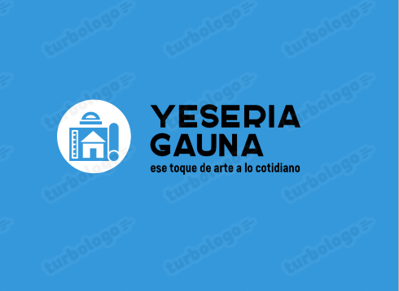

# Yeseria Gauna

- [APIS].............................

- [Dashboard]//(https://github.com/emanuel-gauna/webYeseriaGauna)

## ¿Quienes somos?

Yeseria Gauna es una web dedicada a mostrar, informar y compartir  todo tipo de contenido de yeseria profesional, información contactos y noticias ademas ofrece un  E-commerce con articulos y elementos de Yeseria para brindar un completo disfrute de la página y tenga todo lo relacionado al alcanze de un click, 

Lo que brindamos en nuestra página, es una buena experiencia de navegación, que al momento de buscar lo que necesita no solo sea fácil, sino que también pueda despejar sus dudas sobre lo que busca.
Asesorarse sobre algún trabajo, nuestros proyectos, la distinción y el trayecto de este hermoso oficio que data desde  hace mucho tiempo

El publico al que apunta nuestra página, es a aquellas personas que quieran renovar su casa, remodelar, mejorar su departamento con yeso y molduras! ya que unas de nuestras caracteristicas es ofrecer nuestro servicio de yeseria. refacciones en general de casas , edificios y countrys. Así tambien poder enseñar y dar la opciones a quien quiera y se anime a ingresar a este oficio ofreciendo combos u ofertas en herramientas y materiales, presupuestos.
en nuestra seccion de compra se podran acceder 
a:

- Cuchara de yesero
- Combo de yesero Inicial
- Raspa grande
- Raspin
- Llana catalana
- Ferrocarril mediano.

Ademas nuestra pagina, tiene un link de  "Contactanos"
con redes sociales de contacto(facebook - Whatsapp)para que el usuario califique su experiencia, y tambien pueda despejar sus dudas o preguntas sobre algun articulo trabajo y/o generalidad.

***

## Equipo de trabajo

### Emanuel Gauna, 33 años.
- Estudiante de programación full stack. me gusta la parte de programación y diseño, de paginas web. Atento a seguir las nuevas tecnologías y empezar algún proyecto a gran escala.
- Soy contratista en construcción, rama: yesería y es para mi un gran logro crear un sitio que una mis dos pasiones; construcción y programación poder llega a mas gente lo que me apasiona trasmitir logros propios y a que cualquier persona que se interese pueda conseguir de manera mas accesible su herramientas servicio lo mas rapido y de manera segura

***

## Sitios de referencia

1- [brayco](https://brayco.com.ar/)

De la pagina brayco tome la home y la descripcion de la pagina.

2- [Easy](https://www.easy.com.ar/)

De la pagina de easy tome el carrito de compra.

3- [movistar argentina](https://promociones-movistar-argentina.com.ar/)

me gusto la paleta de color formato de formularios

4- [Mercadopago](https://www.mercadopago.com.ar/)

De la pagina de Mercado pago, tomamos de referencia la forma de Pago y el formulario, y el dasboard izq y las cards de detalle de producto

5-[Tuyango](https://www.tuyango.com/)

De la pagina de tuyango tome paleta de colores y formato de fuente

***

## Link al documento o plataforma que utilicen para organizar el trabajo.

